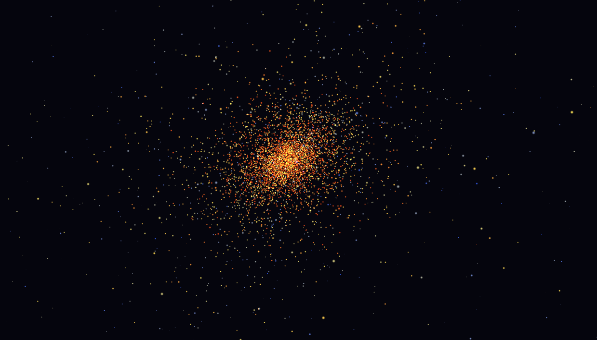

# N-Body Gravitational Simulation

N-body gravitational simulator running entirely on GPU. 8192 particles, RK4 integration, tiled shared memory force kernel.



## Features

- RK4 integrator (4th order accuracy)
- O(N²) all-pairs gravity with tiled shared memory — one global memory read per tile of 256 bodies
- CUDA/OpenGL interop — positions never leave the GPU between sim and render
- Color by velocity — blue (bound) to white (mid) to red (escaping)
- Two initial conditions: Plummer sphere, galaxy collision
- Arcball camera — left drag to orbit, scroll to zoom

## Requirements

- CUDA 12.8+
- GPU with compute capability sm_120 (RTX 5060 Ti / Blackwell)
- CMake 3.24+
- GLFW, GLAD, OpenGL 4.6

## Build

```bash
mkdir build && cd build
cmake .. -DCMAKE_BUILD_TYPE=Release
make -j$(nproc)
./nbody
```

## Controls

| Input | Action |
|---|---|
| Left drag | Orbit camera |
| Scroll | Zoom |
| Esc | Quit |

## Parameters

All tunable constants are in `src/sim.cuh`:

| Constant | Default | Description |
|---|---|---|
| `N` | 8192 | Particle count (in `main.cpp`) |
| `TILE_SIZE` | 256 | Shared memory tile — must match blockDim.x |
| `G` | 1.0 | Gravitational constant (N-body units) |
| `DT` | 0.001 | Timestep |
| `SOFTENING` | 0.05 | Prevents force blowup at close range |

## Structure
src/
├── main.cpp        — window, main loop
├── sim.cuh         — structs, constants, kernel declarations
├── sim.cu          — force kernel, RK4 integration, CUDA kernels
├── renderer.cuh    — renderer declarations
├── renderer.cpp    — OpenGL VBO, shaders, CUDA/GL interop
└── init.cuh        — initial conditions (Plummer sphere, galaxy collision)
shaders/
├── particles.vert
└── particles.frag

## How it works

Each particle gets one CUDA thread. The force kernel tiles all N bodies into blocks of 256, loading each tile into shared memory so every thread in a block reuses the same positions rather than hitting global memory N times each. This drops global memory reads from O(N²) to O(N²/TILE\_SIZE).

RK4 requires four force evaluations per timestep. Each evaluation computes an intermediate state (`pos + scale * derivative`) via `advanceStateKernel`, then runs the full force kernel on that state. The final `integrateKernel` combines the four derivatives with RK4 weights.

Positions are written directly into a GL VBO via a mapped CUDA device pointer — no host roundtrip between simulation and rendering.